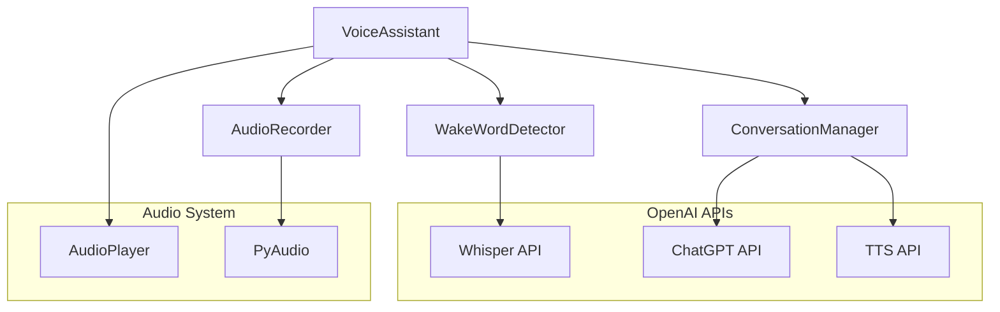

# Voice Assistant

A Python-based voice assistant that enables natural conversations with ChatGPT using voice input and output. The assistant listens for wake words, processes voice commands, and responds with synthesized speech using OpenAI's APIs.

## Features

- Wake word detection using OpenAI's Whisper API
- Natural voice conversations with ChatGPT
- Text-to-speech responses using OpenAI's TTS API
- Automatic session management with configurable timeouts
- Cross-platform audio playback support
- Configurable wake words and audio settings

## Prerequisites

- Python 3.9 or higher
- OpenAI API key
- Microphone
- Audio output device (speakers/headphones)

## Installation

1. Clone the repository:
```bash
git clone https://github.com/m0nkmaster/chat-button.git
cd chat-button
```

2. Install dependencies:
```bash
pip install -r requirements.txt
```

3. Create a `.env` file in the project root:
```bash
OPENAI_API_KEY=your_api_key_here
```

## Usage

Run the assistant:
```bash
python -m src.app
```

Say any of the wake words (e.g., "Hey Chat", "Hi Chat") to begin a conversation. The assistant will play an activation sound and listen for your input. After responding, it will wait for 30 seconds (configurable) before going back to sleep.

## Architecture



## Configuration

The application can be configured through several configuration classes in `src/config.py`:

- `AppConfig`: General application settings (timeout, wake words)
- `AudioConfig`: Audio recording parameters
- `ChatConfig`: ChatGPT API settings
- `TTSConfig`: Text-to-speech settings
- `WakeWordConfig`: Wake word detection parameters

## Development

The project uses a modular architecture with clear separation of concerns:

- `src/audio/`: Audio recording and playback
- `src/conversation/`: Chat management and OpenAI API integration
- `src/wake_word/`: Wake word detection
- `src/utils/`: Common utilities and type definitions

## Testing

Run the test suite:
```bash
pytest tests/
```

## License

MIT License - see LICENSE file for details